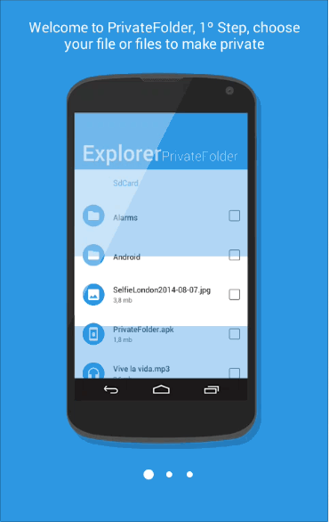

# Phone tutorial



## How to use

If you want use this library, you only have to download PhoneTutorial project, import it into your workspace and add the project as a library in your android project settings.

>This library support Android 2.2

You have to add this lines in the AndroidManifest.xml file too:

```xml
<activity
        android:name="com.gc.phonetutorial.activities.TutorialActivity"
        android:screenOrientation="portrait">
</activity>
```

## Configuration

You can configure some elements of this Activity:

* TITLES (Mandatory) Top titles for each image
* IMAGES (Mandatory) Image for each screen
* COLORINDICATOR Text color for titles and ball page indicator
* COLORBACKGROUND Background color of activity
* COLORBUTTON Change color of nect button
* COLORICON Change color of icon in the NextButton
* ICON Change default icon in the NextButton for other

For more information see [MainActivity](DemoPhoneTutorial/src/com/gc/demophonetutorial/MainActivity.java) of DemoTutorialProyect.

#### Launch activity

For launch this activity you must add this line in your code:

```java
	startActivityForResult(tutorialIntent, TUTORIALACTIVITY);
```

#### Configure next button

For configure next button you have to override `onActivityResult` function, for example:

```java
	final int TUTORIALACTIVITY = 0;
	
	@Override
	protected void onActivityResult(int requestCode, int resultCode, Intent data) {
		
		if(requestCode == TUTORIALACTIVITY){
			if(resultCode == Activity.RESULT_OK){
				// CLick in next button
				Toast.makeText(this, "Next", Toast.LENGTH_SHORT).show();
			}
		}
		
	}
```
